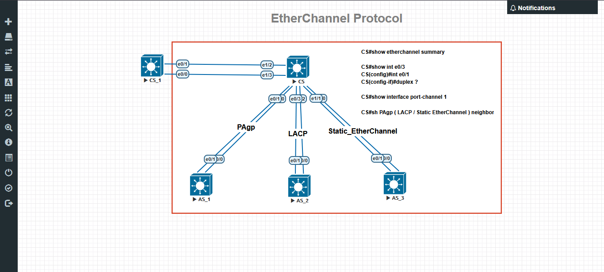

# Cisco Network Engineering & Administration Portfolio

Welcome to my networking portfolio. This repository showcases my hands-on enterprise-level laboratory implementations and configurations.

## 🚀 Active Network Lab Projects

### 1. EtherChannel Protocol Lab Implementation (EVE-NG)
Designed and validated a redundant switching architecture implementing various EtherChannel methods to increase bandwidth and provide link redundancy between Core and Access switches.

#### 🛠️ Technologies & Features Covered:
* PAgP (Port Aggregation Protocol): Cisco proprietary dynamic link aggregation.
* LACP (Link Aggregation Control Protocol): IEEE 802.3ad industry-standard dynamic link aggregation.
* Static EtherChannel: Manual link aggregation configuration.
* Redundancy & Loop Prevention: Verified stability with Spanning Tree Protocol (STP).

#### 📄 Device Configurations:
* [Core Switch (CS_1) Configuration](CS_1-config.txt)
* [Access Switch (AS_1) Configuration](AS_1-config.txt)

#### 📊 Topology Diagram:

---
## 💻 Simulation Tools Used
* EVE-NG (Emulated Virtual Environment Next Generation)
* Cisco IOL (IOS on Linux) Images
